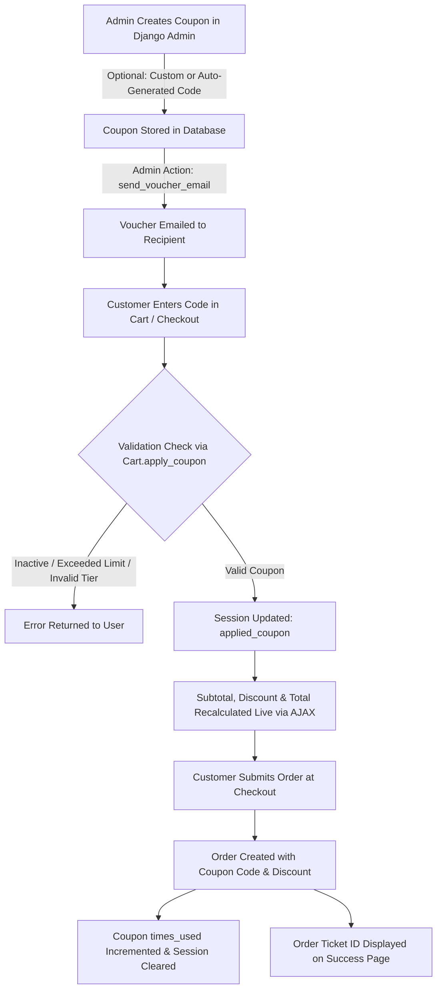

# Aura Spirits — Luxury Cellar & Premium Beverage Platform

[](https://www.djangoproject.com/)
[](https://www.python.org/)
[](https://github.com/)

**Aura Spirits** is a full-featured, luxury e-commerce web application and digital cellar registry crafted for fine spirit connoisseurs and collectors. Built with Django and modern frontend technologies, the platform features a bespoke dark-luxe aesthetic, real-time AJAX cart & wishlist management, dynamic catalog filtering, comprehensive tasting note profiles, concierge order settlement, and an exclusive VIP Voucher & Coupon redemption engine.

---

## 📋 Table of Contents

- [Key Features](#-key-features)
- [How the Voucher & Coupon System Works](#-how-the-voucher--coupon-system-works)
  - [1. Data Model & Architecture](#1-data-model--architecture)
  - [2. Generating & Managing Coupons in Django Admin](#2-generating--managing-coupons-in-django-admin)
  - [3. Automated Email Dispatch](#3-automated-email-dispatch)
  - [4. Customer Redemption Flow](#4-customer-redemption-flow)
  - [5. Order Checkout & Usage Tracking](#5-order-checkout--usage-tracking)
- [Tech Stack](#-tech-stack)
- [Project Directory Structure](#-project-directory-structure)
- [Getting Started & Installation](#-getting-started--installation)
  - [Prerequisites](#prerequisites)
  - [Setup Instructions](#setup-instructions)
  - [Database Seeding](#database-seeding)
  - [Running the Development Server](#running-the-development-server)
- [Running Automated Tests](#-running-automated-tests)
- [AJAX API Reference](#-ajax-api-reference)
- [Admin Credentials & Management](#-admin-credentials--management)
- [License & Credits](#-license--credits)

---

## ✨ Key Features

- 🥃 **Curated Spirit Catalog**: High-resolution bottle imagery, cask specifications, age statements, origin badges, and sensory tasting profiles (Nose, Palate, and Finish notes).
- 🔍 **Live Search & Filter Engine**: Dynamic filtering by category (Whisky, Gin, Tequila, Rum, Vodka, Cognac), price range sliders, collection badges, and keyword search with asynchronous DOM updates.
- 🛒 **Dynamic Cart & Slide-Over Drawer**: Live AJAX-driven cart updates, quantity controls, dynamic free-shipping progress indicators, and instant subtotal recalculations without page reloads.
- 🎟️ **Exclusive VIP Voucher Engine**: Tier-based discount vouchers (10%, 20%, 50%) with automatic unique code generation, redemption tracking, and admin email dispatch.
- ❤️ **Session-Backed Wishlist**: One-click cellar bookmarking with live badge counters.
- 📜 **Concierge & Admin Settlement Workflow**: Generates unique Order Ticket IDs (`AUR-XXXXXXXX`) for private allocation settlement via direct concierge transfer or business WhatsApp.
- ⭐ **Tasting Notes & Verified Reviews**: Community-driven star ratings and sensory review submission.
- 📬 **Newsletter & Concierge Inquiries**: Subscriptions for exclusive cask allocation drops and specialized contact inquiry forms (Cellar Advisory, Private Tastings, Wholesale).

---

## 🎟️ How the Voucher & Coupon System Works

Aura Spirits incorporates a multi-tier VIP coupon and voucher architecture managed via Django models, session middleware, and admin actions.



### 1. Data Model & Architecture (`Coupon` in `store/models.py`)

Each voucher record contains the following properties:

| Field | Type | Description |
|---|---|---|
| `code` | `CharField(unique=True)` | The unique voucher string. If left blank during creation, an automated code in the format `AURA-<TIER>-<6_HEX_CHARS>` (e.g. `AURA-20-F4A1BC`) is generated. All codes are automatically normalized to uppercase. |
| `discount_percent` | `PositiveSmallIntegerField` | Strictly limited to three luxury discount tiers: **10%**, **20%**, or **50%**. |
| `recipient_email` | `EmailField` | Optional email of the VIP customer for targeted issuing and automated dispatch. |
| `recipient_name` | `CharField` | Optional name of the recipient for personalized messages. |
| `description` | `CharField` | Internal notes or reasons for issuing (e.g., "Private Collector Allocation Gift"). |
| `is_active` | `BooleanField` | Controls whether the coupon can currently be redeemed (`True`/`False`). |
| `max_uses` | `PositiveIntegerField` | Maximum total redemptions permitted across all users (`1` for single-use, `0` for unlimited). |
| `times_used` | `PositiveIntegerField` | Counter incremented automatically upon successful order checkout. |
| `expires_at` | `DateTimeField` | Optional expiry timestamp. |

#### Validity Rules (`is_valid()` method)
1. `is_active` must be `True`.
2. If `max_uses > 0`, `times_used` must be strictly less than `max_uses`.
3. `discount_percent` must strictly be one of `[10, 20, 50]`.

---

### 2. Generating & Managing Coupons in Django Admin

1. Navigate to `/admin/store/coupon/` in your browser.
2. Click **Add Coupon**.
3. **Automatic Code Generation**:
   - Select your desired **Discount Tier** (10%, 20%, or 50%).
   - Leave the **Code** field blank.
   - Enter the **Recipient Email** and **Recipient Name** (optional).
   - Set **Max Uses** (default is `1` for single-use exclusive vouchers).
   - Click **Save**. The system will generate a code such as `AURA-20-9B3E2A`.
4. **Manual Custom Code**:
   - Alternatively, enter a custom code (e.g., `VIPWELCOME`, `BLACKCARD50`). It will be automatically converted to uppercase.

---

### 3. Automated Email Dispatch

The Django Admin interface includes a built-in action to dispatch voucher codes to recipients:

1. In the **Coupons** list view in `/admin/store/coupon/`, check the boxes next to the vouchers you wish to send.
2. Open the **Action** dropdown at the top of the table.
3. Select **"Send selected voucher code(s) to recipient email"** and click **Go**.
4. The system will send a branded email containing:
   - Personalized greeting to `recipient_name`
   - The unique voucher code
   - The discount tier percentage
   - Instructions on applying the code during checkout

---

### 4. Customer Redemption Flow

1. The customer adds bottles to their cart.
2. In the **Cart slide-over drawer** or on the **Cart page** (`/cart/`), they input the code in the **VIP Voucher** field and click **Apply**.
3. The frontend sends an asynchronous `POST` request to `/api/cart/coupon/`.
4. The backend validates the code:
   - If valid, the code is saved in the customer's session (`request.session['applied_coupon']`).
   - The cart calculates:
     $$\text{Discount} = \frac{\text{Subtotal} \times \text{Discount Percent}}{100}$$
     $$\text{Total} = \max(0, (\text{Subtotal} - \text{Discount}) + \text{Shipping})$$
   - Real-time JSON data returns the updated discount and total, dynamically updating the UI.

---

### 5. Order Checkout & Usage Tracking

1. When the customer submits their order at `/checkout/`:
   - An `Order` record is created storing the `subtotal`, `discount`, `shipping_cost`, `total`, and `coupon_code`.
   - The corresponding `Coupon` record has its `times_used` incremented by 1.
   - If `times_used` reaches `max_uses`, the code cannot be redeemed again.
   - The user is redirected to `/order/success/<order_number>/` displaying their full ticket breakdown and concierge settlement instructions.

---

## 🛠️ Tech Stack

- **Backend Framework**: [Django 6.1.1](https://www.djangoproject.com/) (Python 3.12+)
- **Database**: SQLite3 (Default development) / Compatible with PostgreSQL & MySQL
- **Frontend Architecture**: Semantic HTML5, Vanilla JavaScript (ES6+), Vanilla CSS (Custom Design System)
- **Design System**: Glassmorphism, CSS Custom Properties, Dark Luxe Palette (Obsidian, Amber Gold, Warm Copper)
- **Typography & Icons**: Cormorant Garamond, Inter, [Phosphor Icons](https://phosphoricons.com/)
- **Testing**: Django Built-in Test Framework (`TestCase`, `Client`)

---

## 📂 Project Directory Structure

```text
aura_spirits/
│
├── aura_spirits_config/         # Core Django project configuration
│   ├── __init__.py
│   ├── asgi.py
│   ├── settings.py              # Application settings, session config, template processors
│   ├── urls.py                  # Root URL configuration
│   └── wsgi.py
│
├── store/                       # Main e-commerce application
│   ├── admin.py                 # Admin registration, inline reviews, Coupon email actions
│   ├── apps.py                  # Store application configuration
│   ├── cart.py                  # Session-based Cart & Coupon calculation engine
│   ├── context_processors.py    # Global context for cart count, wishlist, categories
│   ├── models.py                # Database models: Product, Category, Order, Coupon, Review, etc.
│   ├── tests.py                 # Automated unit and integration test suite
│   ├── urls.py                  # Store URL routing and API endpoints
│   ├── views.py                 # Views for catalog, product details, cart, checkout, APIs
│   │
│   ├── management/              # Custom management commands
│   │   └── commands/
│   │       └── seed_spirits.py  # Database seeder (categories, spirits, reviews, admin user)
│   │
│   └── migrations/              # Database migration history
│
├── static/                      # Static assets
│   ├── css/
│   │   └── custom.css           # Luxury dark design system, animations, responsive rules
│   ├── js/
│   │   └── custom.js            # AJAX cart/wishlist handlers, coupon forms, filter logic
│   └── images/                  # Static logos, badges, and default assets
│
├── templates/                   # Django template hierarchy
│   ├── base.html                # Master layout with header, navigation, footer, cart drawer
│   └── store/
│       ├── home.html            # Landing page with hero, curated spirits, heritage section
│       ├── catalog.html         # Product catalog with filter sidebar and live search
│       ├── product_detail.html  # Bottle specs, tasting notes (Nose/Palate/Finish), reviews
│       ├── cart.html            # Cellar cart review and VIP voucher input
│       ├── checkout.html        # Concierge checkout and customer details form
│       ├── order_success.html   # Order allocation ticket & concierge settlement details
│       ├── wishlist.html        # Saved spirits collection
│       ├── heritage.html        # Brand story and distillery craftsmanship
│       ├── contact.html         # Inquiries, private tastings, and cellar advisory
│       └── includes/            # Reusable sub-templates (product cards, grid, etc.)
│
├── db.sqlite3                   # SQLite database
├── manage.py                    # Django CLI entrypoint
├── requirements.txt             # Python package dependencies
└── README.md                    # Project documentation
```

---

## 🚀 Getting Started & Installation

### Prerequisites

- **Python**: Version 3.10, 3.11, or 3.12+
- **Pip** and **Virtualenv**

### Setup Instructions

1. **Clone the repository and enter the directory**:
   ```bash
   git clone <repository_url>
   cd aura_spirits
   ```

2. **Create and activate a virtual environment**:
   - **Windows (PowerShell)**:
     ```powershell
     python -m venv venv
     .\venv\Scripts\Activate.ps1
     ```
   - **macOS / Linux**:
     ```bash
     python3 -m venv venv
     source venv/bin/activate
     ```

3. **Install dependencies**:
   ```bash
   pip install -r requirements.txt
   ```

4. **Apply database migrations**:
   ```bash
   python manage.py migrate
   ```

---

### Database Seeding

Populate the database with curated categories (Whisky, Gin, Tequila, Rum, Vodka, Cognac), luxury bottle inventory with tasting notes, reviews, and create the default admin superuser:

```bash
python manage.py seed_spirits
```

> **Default Admin Account created by seeder:**
> - **Username**: `admin`
> - **Password**: `admin1234`
> - **Email**: `admin@auraspirits.com`

---

### Running the Development Server

Start the local Django server:

```bash
python manage.py runserver
```

Open your browser and navigate to:
- **Storefront**: [http://127.0.0.1:8000/](http://127.0.0.1:8000/)
- **Admin Portal**: [http://127.0.0.1:8000/admin/](http://127.0.0.1:8000/admin/)

---

## 🧪 Running Automated Tests

Aura Spirits comes with an automated test suite covering models, cart calculations, coupon discount validation, wishlist toggles, catalog filtering, and checkout flows.

Run the test suite with:

```bash
python manage.py test
```

Expected output:
```text
Creating test database for alias 'default'...
........
----------------------------------------------------------------------
Ran 8 tests in 0.210s

OK
Destroying test database for alias 'default'...
```

---

## 📡 AJAX API Reference

All AJAX endpoints accept JSON payloads and return structured JSON responses with updated cart state.

| Endpoint | Method | Payload | Description |
|---|---|---|---|
| `/api/cart/add/` | `POST` | `{"product_id": int, "quantity": int, "override": bool}` | Adds or increments an item in the cart. |
| `/api/cart/update/` | `POST` | `{"product_id": int, "quantity": int}` | Modifies line-item quantity (removes if quantity is 0). |
| `/api/cart/remove/` | `POST` | `{"product_id": int}` | Removes a specific product from the cart. |
| `/api/cart/clear/` | `POST` | `{}` | Clears all items and resets applied vouchers. |
| `/api/cart/coupon/` | `POST` | `{"code": string}` | Validates and applies a VIP discount voucher code. |
| `/api/cart/data/` | `GET` | _None_ | Retrieves the current cart dictionary, subtotal, discount, and items. |
| `/api/wishlist/toggle/` | `POST` | `{"product_id": int}` | Toggles product bookmark in user session wishlist. |
| `/api/newsletter/subscribe/` | `POST` | `{"email": string}` | Subscribes an email to the Cellar Club newsletter. |

---

## 🔐 Admin Credentials & Management

- **Admin URL**: `/admin/`
- **Username**: `admin`
- **Password**: `admin1234`

### Key Admin Modules:
- **Coupons**: Generate 10%, 20%, or 50% vouchers, assign recipient emails, trigger email dispatches, and toggle active states.
- **Products**: Manage bottle descriptions, prices, sale prices, ABV %, tasting notes, cask types, stock levels, and badges.
- **Orders**: Inspect order allocations, view applied coupon codes, verify contact information, and update status (`Processing` $\rightarrow$ `Cellar Preparation` $\rightarrow$ `Dispatched` $\rightarrow$ `Delivered`).
- **Contact Inquiries**: Review incoming inquiries for Private Tastings and Cellar Advisory.

---

## 📄 License & Credits

- **Aura Spirits** &copy; 2026. All rights reserved.
- **Crafted with**: Django, Vanilla CSS, Phosphor Icons, and Google Fonts (Cormorant Garamond & Inter).
